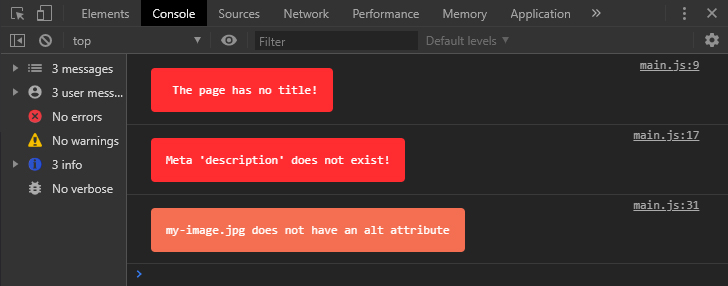
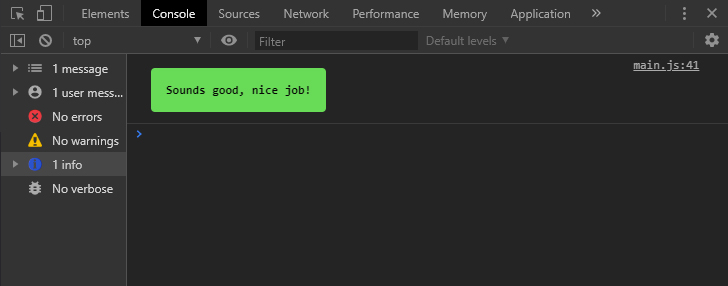

# SEO helper


A little script that checks if your SEO is good.

It checks if title, description, heading and images are good.

That's it.

---

## Installation

### Via CDN

```html
<script src="https://cdn.jsdelivr.net/gh/tunguskha/seo-helper@latest/seo-helper.min.js"></script>
```

### Via npm

```cli
npm i -D seo-helper
```

Import

```js
import { SEOhelper } from 'seo-helper';

SEOhelper() 
```

---

#### Example

<p align="center">
  
</p>

<p align="center">
  
</p>
